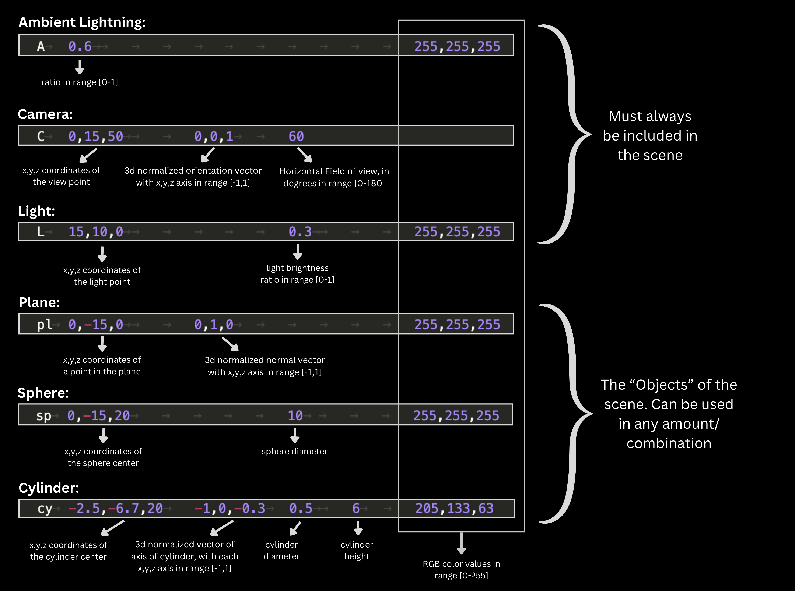

# 
# 
**miniRT**

# 
 A program coded in   in accordance with [The Norm](https://github.com/42School/norminette/blob/master/pdf/en.norm.pdf) of 42 School. 

> 

## 📝 Description
"_The goal of this project is to generate images using the **Raytracing protocol**. Those computer-generated images each represent a scene, as seen from a specific angle and position, defined by simple geometric objects, and each with its own lighting system._"

In simpler words, from a 'weird' **.rt file**, full of numbers that follow _specific guidelines_, we generate **images**, that represent the "scene" that the .rt file "describes":

Graphics Library that was used: [MLX42](https://github.com/codam-coding-college/MLX42)
 

## 🎯 Mandatory requirements:
> as specified on the [Subject](https://github.com/rphlr/42-Subjects/blob/main/common-core/miniRT/en.subject.pdf)

✔️ Handling of the three geometric objects: **plane** 🃏, **sphere** 🏀 and **cylinder** 🧨.  
✔️ Management of all possible **intersections** of the objects. 
✔️ **Resizing** of the object's unique properties: diameter for a sphere, width and height for a cylinder. 
✔️ Implementation of **Ambient** and **Diffuse lightning**. (Ambient so that the objects are never in the dark.)  
✔️ **Hard shadows** and **soft brightness**. 
✔️ The program displays the image in a window, which can be closed by clicking either **ESC** or the red cross on the window's frame.
✔️ The program must take as first argument a scene description file with the **.rt** extension:

### Scene decription file (.rt) requirements:
- Each type of element can be separated by one or more line break(s).
- Each type of information from an element can be separated by one or more space(s), and/or tabs.
- Each type of element can be set in any order in the file.
- Elements which are defined by a capital letter (A,C,L) can only be declared once in the scene.
- Each element first’s information is the **type identifier** (composed by one or two character(s)), followed by all specific information for each object in a strict order as follows:

## ⭐ Additional (bonus) features that we added:

###  ▶️ General Prerequisites:
